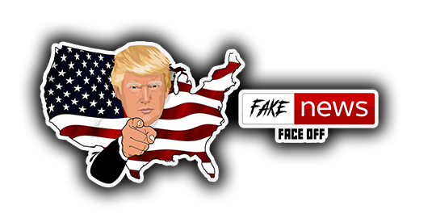

# 1. Trump Fake News Face Off - README

## 1.1 Overview
Welcome to **Trump Fake News Face Off**, a fun and fast-paced game that takes a pinch of humor from American politics. The goal of the game is simple: click on Donald Trump as he moves across the game board to rack up points, while avoiding clicking on news reporters that pop up to distract you. Stay sharp and stay focused because the fake news is trying to fool you!

## 1.2 Game Objective
The objective of the game is to score as many points as possible by clicking on Donald Trump while avoiding news reporters. As Trump moves around the board, you'll need to stay alert and click on him to increase your score. Be careful not to click on any reporters, as doing so will end the game. 
If you score more than 150 points, you have succesfully avoided the Fake-News!

---

## 2. Target Audience
The game is designed for:
- **Casual gamers** who enjoy light-hearted, humorous content.
- **Political enthusiasts** with a sense of humor who follow news and current events.
- **Fans of simple, arcade-style games** who enjoy quick, reaction-based challenges.
- **Players of all ages** looking for a quick and fun game.

---

## 3. Aim and Purpose of the Site
The purpose of the site is to provide a fun and engaging game for users to relax, laugh, and test their reaction speed. The aim is to create a game that captures the attention of players by blending humor and politics in a lighthearted way, with a focus on quick reactions, accuracy, and fun gameplay. This project also demonstrates game development skills, including animation, user interaction, and sound integration.

---

## 4. Planning and Development
### 4.1 Wireframes
Before diving into the code, I created wireframes to get a solid idea of how the game would look and flow. These wireframes helped me lay out where everything would go on the screen—things like the game board, score tracker, timer, buttons for restarting, and instructions. I made sure to keep it simple and focused on the key elements: the 3x3 grid of clickable tiles. As for the Trump character, I wanted to tie it into the current world vibe, especially with the whole "fake news" thing he’s known for. It just seemed like a fitting touch!

I chose to build the website with a mobile-first approach, starting with a width of 320px, so I only needed to scale up for responsiveness. This led to fewer media queries for scaling and styling, allowing me to focus on the styles once without facing the complexities I encountered in project one.

### 4.2 Colour Palette
For the colors, I wanted to keep it bold and eye-catching but also not too overwhelming. I chose a black background to make the podiums, reported and trump character to stand out. The colors, logos and images give it a bit of a “news channel” vibe while keeping things playful.

This colour palette is perfect for a game, offering a mix of warmth, contrast, and dynamic elements. The rich brown (#6e3a21) sets a grounded, immersive environment, while the muted gold (#cfa76e) adds a touch of luxury or highlights important features like rewards or special items. The deep red (#ba261a) brings intensity and excitement, making it ideal for key action points or danger zones. Neutral grey (#808080) helps balance the design without distracting from gameplay, while white (#ffffff) ensures clarity for text or icons. Black (#000000) provides strong contrast and depth, enhancing the visual impact of the overall game experience.

### 4.3 Typography
The typography used in the game includes:
- **Fonts**: Arial, Helvetica, sans-serif
- **Game instructions**: Arial, Helvetica, sans-serif

--- 

### 4.4 Features & Controlls
- **Audio**
<audio id="trumpInstructions" src="assets/audio/trumpInstructions.mp3"></audio>
<audio id="muteSound" src="assets/audio/muteSound.mp3"></audio>
<audio id="success" src="assets/audio/fakeNews.mp3"></audio>
<audio id="gameOverLosingSound" src="assets/audio/gameOverLosingSound.mp3"></audio>
<audio id="gameOverWinningSound" src="assets/audio/gameOverWinningSound.mp3"></audio>

In my Trump Game, I carefully selected specific audio files to enhance the overall experience and align with the game's tone. The audio choices are designed to capture the game's dynamic atmosphere, using sound effects and background music that reflect key events or actions. These files were chosen for their clarity, relevance, and ability to engage players, adding an extra layer of immersion and excitement while complementing the visuals and gameplay mechanics. The high-quality audio ensures a smooth, cohesive experience that keeps players engaged.

- **Hero Image**

This image was selected because it aligns well with the game's theme, capturing the intended mood and atmosphere. The high contrast makes important elements pop, ensuring they grab attention and enhance the player's experience. Its strong visual impact complements the gameplay, creating an engaging environment that is both aesthetically fitting and functionally effective for the game's style and narrative.

- **Playable Icons**

- **Pop-up Modal**

The pop-up modal in my Trump Game serves as a dedicated space for displaying game instructions to the player. It was implemented to ensure easy access to clear and concise guidance, without interrupting the flow of gameplay. The modal is triggered by a button and provides a clean, readable layout, ensuring players can quickly understand the game's objectives and controls. Additionally an audio sounds is played about that goes in conjuction with the game.

---

## 5. Testing and Debugging
The game underwent multiple stages of testing, including:
- **Functional testing**: Ensuring that clicking Trump increases the score and clicking reporters ends the game.
- **Timing issues**: Adjusting how often Trump and reporters spawn to create a balanced gameplay experience.
- **Sound testing**: Verifying that the sound effects play correctly when Trump is clicked and when the game ends.
- **Game freezing bug**: A bug was encountered where the game would freeze if multiple elements were clicked too quickly. This was traced to overlapping event listeners and timers. The solution involved debouncing the click events and ensuring each target could only be clicked once per appearance.

-**Score display issue** There was a problem where the score wouldn't update in real time due to DOM rendering delays. This was fixed by forcing the score update to occur immediately after the score was incremented, rather than at a fixed interval.

- **Browser compatibility**: Ensuring the game works on major browsers like Chrome, Firefox, and Safari.
- **Mobile responsiveness**: Testing how the game behaves on different screen sizes, adjusting for mobile gameplay.

For the testing of the website, I followed the exact same process I did for project 1, as it seemed to be the most robust way of testing my project as I went along. I intend to use this same process for all my projects, both for the course material as well as any future work I undertake - albeit with additional practices as I learn more languages and tools.

- **HTML & CSS**
I used the W3C Validator website to validate all my HTML and W3C Validator CSS files, as shown below with the corresponding screenshots, as recommended by the Code Institutes' course material:

Pass: No Errors

- **JavaScript**
For my JavaScript I used the JShint Validator to validate my js files, as shown below with the corresponding screenshots, as recommended by the Code Institutes' course material:

---

- **Lighthouse**

After optimizing the hero image by reducing its size to approximately 500px, the performance score improved significantly, jumping from 68 to 92 in the Lighthouse test. This optimization drastically reduced loading times, while still preserving the sharpness and quality of the game’s visuals. The faster load time contributed to a smoother, more responsive user experience, and the improved performance score reflects the positive impact of these changes on overall site efficiency and user satisfaction.

- **Debugging**
Debugging in my code, which is primarily built using JavaScript, HTML, and CSS, has been essential for ensuring everything runs smoothly. I rely on console.log to track variable values and identify any issues with logic or user interactions. In addition, I use the browser’s built-in developer tools to inspect HTML elements, check the styles applied via CSS, and monitor JavaScript errors in the console. By manually testing the game’s features and interactions—such as buttons, modals, and audio control—I can quickly pinpoint and fix issues. This approach helps maintain a clean, bug-free experience while optimizing performance across different browsers.

---

## 6. Deployment
Deployment was done early, following lessons and guidance from the Code Institute Software Development course.
1. The game was developed locally using HTML, CSS, and JavaScript.
2. It was tested on various browsers for compatibility.
3. The final version was deployed to a web server using a platform like GitHub Pages.
4. The deployment process included uploading the HTML, CSS, JavaScript files, and all necessary assets like images and sounds to the server.
5. After deployment, the game was tested again in the live environment to ensure everything worked as expected.

---

## 7. Conclusion
**Trump Fake News Face Off** is a simple, engaging, and humorous game that provides players with a fun way to test their reaction speed while avoiding fake news reporters. The development process focused on creating a fast-paced experience with a clear objective, bright visuals, and interactive elements. The game achieved its aim of being entertaining and accessible to a wide range of players.

---

## 8. Conclusion
**Future Features**
For future improvements to the Trump Game, here are a few ideas to enhance both performance and user experience:

* Lazy Loading for Images: Implement lazy loading for images to ensure that only the images visible on the screen are loaded initially, reducing the initial load time and improving overall performance.
* Audio Control Enhancement: Introduce a feature where only one audio file can play at a time. This prevents overlapping sounds, providing a clearer and more immersive experience. Include options for players to control the audio with mute or volume settings.
* Optimized Asset Delivery: Use image compression and SVGs for icons to reduce the size of visual assets, ensuring faster load times without sacrificing quality.
* Dynamic Difficulty Adjustment (DDA): Implement a system that adjusts the game’s difficulty based on player performance to keep the game engaging for all skill levels.

---

## 9. Credits and Acknowledgements
- **Game Developer**: Robert Lewis
- **Sound Effects**: Parrot App (https://www.tryparrotai.com/ai-voice-generator/donald-trump) for Ai-Generated free-to-use trump voice over.
- **Inspiration**: Classic arcade game Whack-a-Mole.
- **Images and Icons**: Some custom-made images, and a few taken from the internet but none intended for comerical use.
- **Special Thanks**: To friends and family who provided feedback during the testing phase, My Code Insitute mentor Spencer, and personal Java Script tutor Nina.
- **Credits**:
The following tools and technologies were used:

HTML - used to build main site content
CSS - used for main content styling
JavaScript - used for all interactivity within the website
Google - my starting point for understanding and searching for answers to my questions before other programmes were used & images from the web
W3schools - a constant source of reference for all html, CSS and BootStrap explanations
Optimizilla - for image compression
W3C Markup Validation Service - for the html validation
W3C CSS Validation Service - for the CSS validation
Lighthouse - for the performance and accessibility testing
Grok - An AI tool used for general queries and learning
Chat-GBT - An AI tool used for understanding where things went wrong, how to fix code and generally used for deeper understanding of JavaScript
Slack Overflow - for general queries
MSWord - used for grammar and spelling checking
Parrot App - For Ai generated voices
Youtube - Also used for audio

Thank you for playing **Trump Fake News Face Off**! Enjoy the game and don’t get fooled by the fake news!
